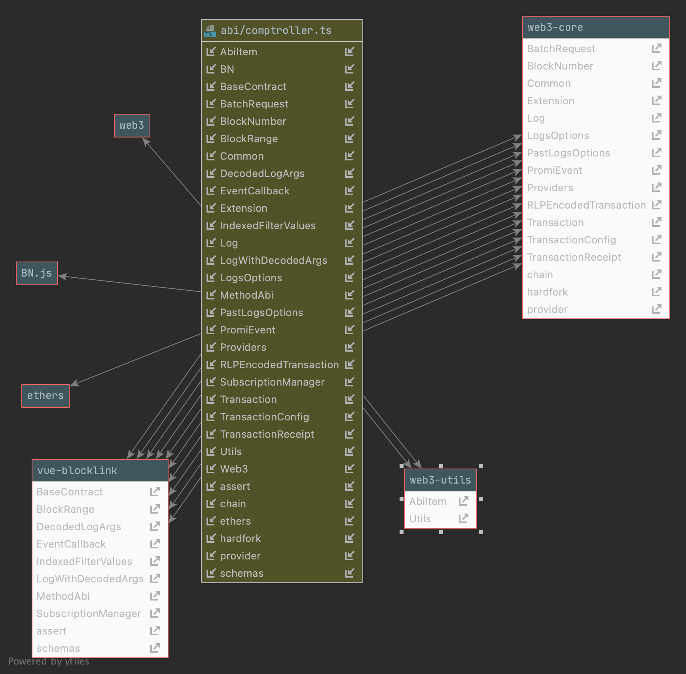

# BalincerDapp

Final dApp based on VUE2.0

### page layouts

- markets --> https://eth.lever.network/Markets
- margin --> https://eth.lever.network/Margin
- dashboard -->  similar to https://app.betafinance.org/positions
- stakings --> https://tokenomics.alphafinance.io/staking ui and function use https://eth.lever.network/Staking
- bridge
- borrow --> similar to AAVE
- lending --> similar to AAVE
- fundingop --> https://eth.lever.network/Deposit?type=Deposit

### Sheet information:

- guide

### Header page elements

- Logo
- Price line - very simple chart
- menu big topics
- connect wallet top right corner
- doc link
- languages

### Package dependencies

    "vue-animation-counter": "^1.0.30", dynmaic animation number and display for solidity specific
    "vue-backgrounds": "^1.0.56", the frontend rendering engines / three.js / pixi.js / componenet structs
    "vue-blocklink": "^0.1.252", the core-SDK for metamask apis
    "vue-clipboard2": "^0.3.1", the clipboard component
    "vue-codepin": "^0.3.28", the pin enter component
    "vue-content-placeholders": "^0.2.1",
    "vue-dynamic-forms": "^1.1.0",
    "vue-echarts": "^3.1.3", echart engine is ready
    "vue-good-table": "^2.17.4",
    "vue-js-modal": "^1.3.26",
    "vue-multiselect": "^2.1.6",
    "vue-no-ssr": "^1.1.1",
    "vue-resource": "^1.5.1",
    "vue-router": "^3.1.3",
    "vue-select": "^2.5.1",
    "vue-server-renderer": "^2.5.17",
    "vue-template-compiler": "^2.5.17",
    "vue-truncate-filter": "^1.1.7",
    "vue2-datatable-component": "^2.3.1",
    "vue2-timeago": "^1.2.2", 
    "vuetable-2": "^1.7.5",
    "web3": "^1.6.0" web3 core engine

### Contract deplendencies
- All contract typescript files are located at `src/api/abi`
- Make all the typescripts to js files using this command:
`tsc -p`
- Auto fix errors and reformating using this command:
`cnpm run listTs`

### Environment setups
- install nodejs v12.20.0 - LTS
- install python3.8 + 
- using vue2.0 latest framework
- using vuetify for the latest UI framework


### Contract Usage Example

First, make sure you have compiles all `ts` files into `js` files.


To initialize the contract from the class `ComptrollerContract` from this `comptroller.ts` file
```
import {ComptrollerContract} from "@/api/abi/comptroller."

 if (!ComptrollerContract.Instance()) {
        const defined_contract = await ComptrollerContract.init(
          process.env.comptroller_contract_address,
          this.ethereum,
          this.w3)
        defined_contract.setBlockLink(this.blockLink)
        defined_contract.setResource(this.gas, this.gasPrice)
        defined_contract.setDebug(false)
      }
```

This is the standard implementation, the contract can be simply calling the method directly.



```
import {ComptrollerContract} from "@/api/abi/comptroller."


    checkInsFail() {
      if (!ComptrollerContract.Instance()) {
        this.failed_payment_message = "ComptrollerContract instance is not found."
        console.error(this.failed_payment_message)
        this.trx_failured()
        return true
      } else {
        return false
      }
    },


    trx_failured() {
      this.withdrawalloading = false
      this.notificationError(this.failed_payment_message)
      this.appendTransactionHistoryItem("payment", "oke", this.failed_payment_message)
    },


    /**
     * contract method
     * @returns {Promise<void>}
     */
    async borrow_money() {
      if (this.checkInsFail()) {
        return
      }

      const ctoken_address = "0x...."
      const borrowe_address = "0x...."
      //18 decimal maybe ...
      const borrow_amount = new BN(100000000000000000000);
      try {
        await ComptrollerContract.Instance().borrowVerify(ctoken_address, borrowe_address,borrow_amount);
      } catch (e) {
        //this is the plugin module located at vue-notification.js
        this.$handleErrorEvm(e)
        this.caught_fails()
      }
    }
```

Calling all the functions from `ComptrollerContract` is easy because they are all wrapped inside the class file. As you can see from the below source code:
```

// tslint:enable:no-unused-variable
export interface ContractInterface {
    _become(unitroller: string,_oracle: string,_closeFactorMantissa: BN,_maxAssets: BN,reinitializing: boolean,):Promise<void>
    _setCloseFactor(newCloseFactorMantissa: BN,):Promise<BN>
    _setCollateralFactor(cToken: string,newCollateralFactorMantissa: BN,):Promise<BN>
    _setLiquidationIncentive(newLiquidationIncentiveMantissa: BN,):Promise<BN>
    _setMaxAssets(newMaxAssets: BN,):Promise<BN>
    _setPriceOracle(newOracle: string,):Promise<BN>
    _supportMarket(cToken: string,):Promise<BN>
    accountAssets(index_0: string,index_1: BN,):Promise<string>
    admin():Promise<string>
    borrowAllowed(cToken: string,borrower: string,borrowAmount: BN,):Promise<BN>
    borrowVerify(cToken: string,borrower: string,borrowAmount: BN,):Promise<void>
    checkMembership(account: string,cToken: string,):Promise<boolean>
    closeFactorMantissa():Promise<BN>
    comptrollerImplementation():Promise<string>
    enterMarkets(cTokens: string[],):Promise<BN[]>
    exitMarket(cTokenAddress: string,):Promise<BN>
    getAccountLiquidity(account: string,):Promise<[BN, BN, BN]>
    getAssetsIn(account: string,):Promise<string[]>
    isComptroller():Promise<boolean>
    liquidateBorrowAllowed(cTokenBorrowed: string,cTokenCollateral: string,liquidator: string,borrower: string,repayAmount: BN,):Promise<BN>
    liquidateBorrowVerify(cTokenBorrowed: string,cTokenCollateral: string,liquidator: string,borrower: string,repayAmount: BN,seizeTokens: BN,):Promise<void>
    liquidateCalculateSeizeTokens(cTokenBorrowed: string,cTokenCollateral: string,repayAmount: BN,):Promise<[BN, BN]>
    liquidationIncentiveMantissa():Promise<BN>
    markets(index_0: string,):Promise<[boolean, BN]>
    maxAssets():Promise<BN>
    mintAllowed(cToken: string,minter: string,mintAmount: BN,):Promise<BN>
    mintVerify(cToken: string,minter: string,mintAmount: BN,mintTokens: BN,):Promise<void>
    oracle():Promise<string>
    pendingAdmin():Promise<string>
    pendingComptrollerImplementation():Promise<string>
    redeemAllowed(cToken: string,redeemer: string,redeemTokens: BN,):Promise<BN>
    redeemVerify(cToken: string,redeemer: string,redeemAmount: BN,redeemTokens: BN,):Promise<void>
    repayBorrowAllowed(cToken: string,payer: string,borrower: string,repayAmount: BN,):Promise<BN>
    repayBorrowVerify(cToken: string,payer: string,borrower: string,repayAmount: BN,borrowerIndex: BN,):Promise<void>
    seizeAllowed(cTokenCollateral: string,cTokenBorrowed: string,liquidator: string,borrower: string,seizeTokens: BN,):Promise<BN>
    seizeVerify(cTokenCollateral: string,cTokenBorrowed: string,liquidator: string,borrower: string,seizeTokens: BN,):Promise<void>
    transferAllowed(cToken: string,src: string,dst: string,transferTokens: BN,):Promise<BN>
    transferVerify(cToken: string,src: string,dst: string,transferTokens: BN,):Promise<void>
}

```

### Error Catch from the contract response

The file is located at https://gitlab.com/b95token/balincerdapp/-/blob/main/src/plugins/vue-notifications.js

```

const module_handling_error = {
  install: (Vue, opts) => {
    Vue.prototype.$handleErrorEvm = function (error) {
      if (error instanceof String) {
        console.log("==== error on this String ====")
        console.log(error)
      } else if (error instanceof Object) {
        //console.log("==== error on this Object ====")
        if (error.message) {
          this.failed_payment_message = error.message
          if (error.message.includes("invalid BigNumber value")) {
            this.failed_payment_message = "BigNumber format not correct."
          }
          if (error.message.includes("invalid address")) {
            this.failed_payment_message = "Input Address is not correct."
          }
        }
        if (error.toString().includes("execution reverted")) {
          if (error.toString().includes("xxxxx")) {
            this.failed_payment_message = "To explain more for this error"
          }
        }

      } else if (error.error) {
        if (error.error.includes("invalid BigNumber value")) {
          this.failed_payment_message = "BigNumber format not correct."
        }
      } else if (error === "USER_DENIED") {
        this.failed_payment_message = "User denied transaction."
      }
    }
  }
}


```

You only need to change this part:

For example
```

  if (error.toString().includes("xxxxx1")) {
            this.failed_payment_message = "To explain more for this error"
   }

 if (error.toString().includes("xxxxx2")) {
            this.failed_payment_message = "To explain more for this error"
   }
 if (error.toString().includes("xxxxx3")) {
            this.failed_payment_message = "To explain more for this error"
   }
```

### Versioning
Please follow the proper version standard to record the version number and tag the version from specific milestone.
The version file allocated at the root level. Also, the version name in the `package.json` should be corresponded to the version number. 
